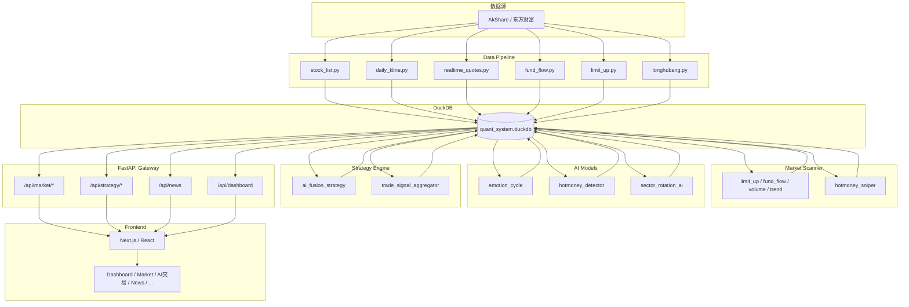

# 红山量化平台 — 项目状态报告

> 用于 AI 分析系统问题的完整状态文档。扫描时间：代码库静态分析 + 架构与配置汇总。

---

## 一、系统架构图（Mermaid）



**数据流简述：**

```
AkShare（东方财富等）
    ↓
Data Pipeline（collectors）
    ↓
DuckDB（data/quant_system.duckdb 统一库）
    ↓
Market Scanner + AI Models + Strategy Engine
    ↓
FastAPI（Gateway）
    ↓
Frontend（Next.js）
```

---

## 二、项目目录结构

```
newhigh/
├── system_core/                   # 统一运行核心（入口与调度）
│   ├── system_runner.py            # 主循环：data → scan → ai → strategy → monitor
│   ├── data_orchestrator.py        # 数据管道调度
│   ├── scan_orchestrator.py        # 市场扫描调度
│   ├── ai_orchestrator.py          # AI 分析调度
│   ├── strategy_orchestrator.py   # 策略调度
│   └── system_monitor.py          # 系统状态写 system_status
├── core/                          # 核心类型与 data_service
│   └── src/core/
│       ├── types.py, constants.py
│       └── data_service/          # db, market_service, strategy_service, portfolio_service
├── data-pipeline/                 # A 股数据管道
│   └── src/data_pipeline/
│       ├── collectors/            # stock_list, daily_kline, realtime_quotes, fund_flow, limit_up, longhubang
│       ├── storage/               # duckdb_manager（market.duckdb）
│       ├── scheduler/             # daily_scheduler, realtime_scheduler
│       └── etl/
├── data-engine/                  # 行情连接器（akshare / astock_duckdb / ClickHouse）
│   └── src/data_engine/
├── market-scanner/               # 市场扫描 + 游资狙击
│   └── src/market_scanner/
│       ├── limit_up_scanner, fund_flow_scanner, volume_spike_scanner, trend_scanner
│       └── hotmoney_sniper/       # theme_detector, fund_spike, volume_pattern, limitup_behavior, sniper_score_engine
├── ai-models/                    # 情绪周期 / 游资席位 / 主线题材
│   └── src/ai_models/
│       ├── emotion_cycle_model.py
│       ├── hotmoney_detector.py
│       └── sector_rotation_ai.py
├── strategy-engine/              # 融合策略与信号聚合
│   └── src/strategy_engine/
│       ├── ai_fusion_strategy.py
│       └── trade_signal_aggregator.py
├── execution-engine/             # 订单与信号执行
│   └── src/execution_engine/      # order_manager, signal_executor, binance_orders
├── backtest-engine/              # 回测与指标
├── ai-optimizer/                 # 自进化权重
│   └── src/ai_optimizer/         # self_evolution_engine
├── gateway/                      # FastAPI API（即 api）
│   └── src/gateway/              # endpoints.py, app.py, ws.py
├── frontend/                     # Next.js 前端
│   └── src/
│       ├── app/                  # 页面：page.tsx, market, news, ai-trading, data, strategies, ...
│       ├── api/                  # client.ts
│       ├── components/, context/, lib/
├── scripts/                      # 运行与定时
│   ├── run_full_cycle.py, run_terminal_loop.py, ensure_market_data.py
│   ├── openclaw_evolution_cycle.py, check_cycle_and_sniper.py, sniper_backtest.py
│   └── schedule/                 # launchd 定时（install_scheduled_run.sh, plist 模板）
├── data/                         # 运行时数据（gitignore）
│   ├── market.duckdb             # 管道 + 扫描 + AI + 策略 表
│   └── quant.duckdb              # 标的/日线/新闻（复制自 astock 或 ensure_ashare）
└── docs/                         # ARCHITECTURE, AI_TRADING_TERMINAL, DATA_AND_EVOLUTION 等
```

**说明**：无单独 `database/` 目录；**统一数据库** `data/quant_system.duckdb`（管道、扫描、AI、策略、日K、标的、新闻 共用）。API 由 `gateway` 提供。环境变量 `QUANT_SYSTEM_DUCKDB_PATH` 可覆盖路径；原 `market.duckdb`/`quant.duckdb` 可通过该变量临时指向旧文件做迁移过渡。

---

## 三、数据库状态（DuckDB）

**库文件**：
- `data/quant_system.duckdb` — **统一库**：data_pipeline、market_scanner、ai_models、strategy_engine、data_engine（日K/标的/新闻）共用；由 `data_pipeline.storage.duckdb_manager` 管理路径与 ensure_tables。

**quant_system.duckdb 表结构（由 ensure_tables 创建）**：

| 表名 | 用途 | 字段 |
|------|------|------|
| a_stock_basic | 股票池 | code (PK), name, sector (可选) |
| a_stock_daily | 日 K 线 | code, date (PK), open, high, low, close, volume, amount |
| a_stock_realtime | 实时行情 | code, name, latest_price, change_pct, volume, amount, snapshot_time |
| a_stock_fundflow | 资金流 | code, name, main_net_inflow, snapshot_date, snapshot_time |
| a_stock_limitup | 涨停池 | code, name, price, change_pct, limit_up_times, snapshot_time |
| a_stock_longhubang | 龙虎榜 | code, name, lhb_date, net_buy, snapshot_time, seat_name (可选), buy_amount (可选) |
| market_signals | 扫描信号 | code, signal_type, score, snapshot_time |
| market_emotion_state | 情绪状态（旧） | state, stage, limit_up_count, score, snapshot_time |
| market_emotion | 情绪每日指标 | trade_date (PK), limitup_count, max_height, market_volume, emotion_state, snapshot_time |
| hotmoney_signals | 游资信号 | code, seat_type, win_rate, snapshot_time |
| top_hotmoney_seats | 游资席位胜率 | seat_name (PK), trade_count, win_rate, avg_return, snapshot_time |
| sector_strength | 板块强度 | sector, strength, rank, snapshot_time |
| main_themes | 主线题材 | sector, total_volume, rank, snapshot_time |
| trade_signals | 交易信号 | code, signal, confidence, target_price, stop_loss, strategy_id, signal_score, snapshot_time |
| sniper_candidates | 游资狙击候选 | code, theme, sniper_score, confidence, snapshot_time |
| system_status | 系统运行状态（system_core） | data_status, scanner_status, ai_status, strategy_status, snapshot_time |
| daily_bars | 日K（astock 结构） | order_book_id, trade_date, adjust_type, open, high, low, close, volume, ... |
| stocks | 标的（astock 结构） | order_book_id, symbol, name, market, ... |
| news_items | 新闻 | symbol, source_site, title, content, publish_time, sentiment_score, ... |

**数据量**：取决于是否执行 `system_core.system_runner`、`ensure_market_data.py`、`run_full_cycle.py` 或 `copy_astock_duckdb_to_newhigh.py`（目标默认 `quant_system.duckdb`）。未跑前为空或仅表结构。可通过 `scripts/check_cycle_and_sniper.py` 或 `scripts/.openclaw_state.json` 的 `data_health` 查看当前条数。

---

## 四、数据管道状态

| 模块 | 文件 | 写入表 | 说明 |
|------|------|--------|------|
| 股票池 | stock_list.py | a_stock_basic | akshare stock_info_a_code_name；正常写入，异常 return 0 |
| 日 K 线 | daily_kline.py | a_stock_daily | akshare 东方财富/历史接口；ON CONFLICT 更新；异常 return 0 |
| 实时行情 | realtime_quotes.py | a_stock_realtime | akshare stock_zh_a_spot_em；INSERT 追加 |
| 资金流 | fund_flow.py | a_stock_fundflow | akshare stock_individual_fund_flow_rank；INSERT 追加 |
| 涨停池 | limit_up.py | a_stock_limitup | akshare stock_zt_pool_em；INSERT 追加 |
| 龙虎榜 | longhubang.py | a_stock_longhubang | akshare stock_lhb_detail_em；INSERT 追加 |

**是否正常运行**：逻辑完整，依赖 akshare 与 network；异常时多处 `try/except` 返回 0 或 pass，不抛错。  
**是否写入数据库**：是，均通过 `duckdb_manager.get_conn()` + `ensure_tables(conn)` 后 INSERT。  
**是否报错**：运行时若 akshare 未安装或接口失败会静默返回 0，无 Traceback 上抛。

---

## 五、调度系统

| 调度 | 文件 | 运行方式 | 自动运行 | 运行频率 |
|------|------|----------|----------|----------|
| 每日 | daily_scheduler.py | 调用 `run_daily()`，需脚本或 cron/launchd 触发 | 否（需配置） | 建议每日 18:00 一次 |
| 实时 | realtime_scheduler.py | 调用 `run_realtime_loop(interval_seconds=30)`，内部 while True | 否（需单独进程/任务） | 每 30 秒 |

**自动运行**：当前无内置 daemon。可通过以下方式定时：
- **launchd**：`bash scripts/schedule/install_scheduled_run.sh`（每周一至五 18:30，锁屏也会跑）
- **cron**：自行添加 18:30 执行 `run_full_cycle.py` 或 `ensure_market_data.py`

---

## 六、API 接口（FastAPI Gateway）

**前缀**：`/api`（app 挂载 prefix="/api"）

| 方法 | 路径 | 说明 | 数据来源 |
|------|------|------|----------|
| GET | /market/realtime | 实时行情 | market.duckdb a_stock_realtime |
| GET | /market/limitup | 涨停池 | market.duckdb a_stock_limitup |
| GET | /market/fundflow | 资金流 | market.duckdb a_stock_fundflow |
| GET | /market/emotion | 情绪周期 | market_emotion（优先）或 market_emotion_state |
| GET | /market/hotmoney | 游资席位 | top_hotmoney_seats |
| GET | /market/main-themes | 主线题材 | main_themes |
| GET | /market/sniper-candidates | 游资狙击候选 | sniper_candidates |
| GET | /system/status | 系统运行状态（data_pipeline/scanner/ai_models/strategy_engine/last_update + history） | system_status |
| GET | /strategy/signals | 交易信号 | trade_signals |
| GET | /market/klines | K 线 | quant.duckdb 或 data_engine |
| GET | /data/status | 数据状态 | quant.duckdb |
| GET | /stocks | 股票列表 | core data_service |
| GET | /market/summary | 市场概览 | core data_service |
| GET | /news | 新闻 | quant.duckdb news_items；空时 akshare fallback |
| GET | /dashboard | 控制台 | DuckDB 聚合或 stub |
| GET | /strategies, /portfolio/weights, /risk/status, /positions | 策略/组合/风控 | stub |
| POST | /backtest/run | 回测 | stub |
| GET | /evolution, /trades, /alpha-lab | 进化/成交/Alpha | stub |

**是否返回数据**：依赖数据库是否有数据；有则返回，无则返回空数组/默认值。  
**是否连接数据库**：market 相关读 `data_pipeline.storage.duckdb_manager`（market.duckdb）；news/data 状态读 data_engine 或 quant.duckdb。

---

## 七、前端连接（Next.js / React）

**页面列表**（`frontend/src/app/`）：

| 路径 | 页面 | 调用 API |
|------|------|----------|
| / | Dashboard | dashboard, dataStatus, marketEmotion, sniperCandidates |
| /data | 数据状态 | dataStatus（文档/说明为主） |
| /stocks | 股票列表 | stocks |
| /market | 行情 / K 线 | ashareStocks, market( symbol, interval ) |
| /news | 新闻 | news( symbol?, limit ) |
| /ai-trading | AI 交易 | marketEmotion, marketHotmoney, marketMainThemes, strategySignals, sniperCandidates |
| /strategies | 策略池 | strategies |
| /alpha-lab | Alpha 工坊 | alphaLab |
| /evolution | 进化 | evolution |
| /portfolio | 组合 | portfolio |
| /risk | 风控 | risk |
| /trade | 交易 | trades |
| /reports | 报告 | — |
| /settings | 设置 | — |

**是否成功获取数据**：前端通过 `apiGet('/api/...')` 请求；若 Gateway 未启动或表无数据，会 404 或空数据，前端有部分错误态与「数据不全」引导（如 AI 交易页、新闻页、Dashboard）。

---

## 八、数据流（文字）

```
1. AkShare（东方财富等）
   → data_pipeline collectors（stock_list, daily_kline, realtime_quotes, fund_flow, limit_up, longhubang）
   → 写入 data/market.duckdb

2. market.duckdb
   → market_scanner（limit_up / fund_flow / volume / trend / hotmoney_sniper）
   → 写入 market_signals、sniper_candidates

3. market.duckdb
   → ai_models（emotion_cycle, hotmoney_detector, sector_rotation_ai）
   → 写入 market_emotion, top_hotmoney_seats, main_themes, hotmoney_signals, sector_strength

4. market.duckdb
   → strategy_engine（ai_fusion_strategy）
   → 写入 trade_signals（含 signal_score）

5. FastAPI（gateway）
   → 读取 market.duckdb / quant.duckdb
   → 提供 /api/market/*, /api/strategy/*, /api/news, /api/dashboard 等

6. Frontend（Next.js）
   → 请求 /api/*（可配置 NEXT_PUBLIC_API_TARGET 代理到 Gateway）
   → 展示 Dashboard、行情、AI 交易、新闻等
```

---

## 九、错误与异常（代码内模式）

**说明**：以下为代码中存在的异常处理/占位模式，非必然运行时错误。

- **try/except + pass 或 return 0**：多处用于 akshare 失败、表不存在、无数据时静默降级（如 gateway endpoints、collectors、ai_models、duckdb_manager 的 ALTER）。
- **ImportError**：data_engine、gateway 等处对可选依赖（如 akshare）做 try/import，失败则不用 fallback 或返回空。
- **DB 相关**：conn 获取失败或路径不存在时返回 None/[]；ensure_tables 中 ALTER 已存在列会捕获异常忽略。
- **API**：未启动 Gateway 时前端请求返回 404 或跨域/连不上；前端部分页面已做 .catch 与「API 未连接/数据不全」提示。

**未发现硬编码 Traceback 打印**；异常多为捕获后 pass 或 return。

---

## 十、未完成/占位模块

| 位置 | 类型 | 说明 |
|------|------|------|
| gateway/endpoints.py | 多处 pass | 依赖不可用时静默降级 |
| duckdb_manager.py | ALTER 后 pass | 列已存在时忽略错误 |
| ai_models（emotion, hotmoney, sector） | except pass | 无表/无数据时返回空 |
| market_scanner hotmoney_sniper | try/except pass | 连接或表不存在时降级 |
| strategy_engine ai_fusion_strategy | except pass | 读取信号失败时跳过 |
| ai_optimizer self_evolution_engine | pass | get_strategy_return / get_market_return 占位返回 None |
| core data_service market_service | pass | 部分分支未实现 |
| backtest_engine metrics | pass | 部分指标未实现 |
| execution_engine signal_executor | 占位 | execute_buy/execute_sell 为 stub，不实盘 |
| 多种 stub 接口 | 返回空或固定值 | strategies, portfolio, risk, positions, backtest, evolution, trades, alpha-lab |

**TODO/FIXME**：代码库中无集中 TODO 注释；未完成逻辑主要体现在「pass 或 return 空/stub」上。

---

## 十一、主要问题与建议

| 问题 | 建议 |
|------|------|
| 数据全为空 | 先跑 `ensure_market_data.py` 再 `run_full_cycle.py`；新闻可依赖 akshare fallback |
| API 404 | 启动 Gateway：`uvicorn gateway.app:app --reload --port 8000` |
| 前端拿不到数据 | 确认 next.config.js 的 rewrite 指向正确 API；检查 NEXT_PUBLIC_API_TARGET |
| 调度未自动跑 | 使用 `scripts/schedule/install_scheduled_run.sh` 或自建 cron |
| 表不存在 | 任意调用 ensure_tables 的流程跑一次即可（如 run_full_cycle） |
| 自进化/数据健康 | 运行 `openclaw_evolution_cycle.py`，查看 `scripts/.openclaw_state.json` 的 data_health |

---

## 十二、文档与脚本速查

| 文档 | 内容 |
|------|------|
| **docs/PROJECT_HANDOFF_FOR_AI.md** | **项目交接：当前实现/未完成/风险/建议维度，供其他 AI 提出改进建议** |
| **docs/OPENCLAW_IMPROVEMENT_PLAN.md** | **Cursor 执行计划：阶段 0–3 架构升级与 OpenClaw 自我进化集成** |
| **docs/OPENCLAW_WORKSPACE_DELIVERY.md** | **OpenClaw 工作区「hongshan」Vue+FastAPI 交付清单（路径 `/Users/apple/.openclaw/workspace`，与主仓 Next+Gateway 并存）** |
| docs/ARCHITECTURE.md | 整体架构 |
| docs/vision.md, docs/roadmap.md | 愿景与阶段 |
| docs/CURSOR_RELAY.md | Cursor 接续开发（vision → tasks → prompts） |
| docs/AI_TRADING_TERMINAL.md | 数据流、表、API、运行顺序、定时 |
| docs/DATA_AND_EVOLUTION.md | 数据不全改进、新闻增强、OpenClaw、定期执行 |
| scripts/schedule/README.md | launchd 定时安装与卸载 |

| 脚本 | 作用 |
|------|------|
| scripts/ensure_market_data.py | 填充 market.duckdb（池 + 涨停/龙虎榜/资金流；可选日 K） |
| scripts/run_full_cycle.py | 数据 + 扫描 + AI + 融合信号 |
| scripts/run_terminal_loop.py | 仅扫描 + AI + 融合（不拉数据） |
| scripts/check_cycle_and_sniper.py | 跑一轮并检查各表条数 |
| scripts/openclaw_evolution_cycle.py | OpenClaw 自进化（数据补全 + market 填充 + data_health） |
| scripts/schedule/install_scheduled_run.sh | 安装 launchd 定时（周一至五 18:30） |

---

*本文档由代码库扫描与架构文档汇总生成，数据量等运行时状态需执行上述脚本或查询数据库后更新。*
