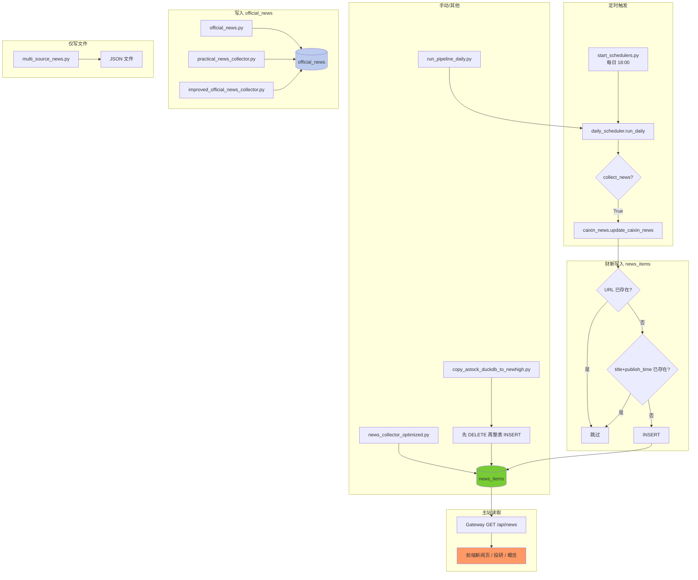

# 新闻采集逻辑总览与重复采集分析

## 1. 数据流与表关系

| 表/存储 | 用途 | 前端/API 是否使用 |
|--------|------|-------------------|
| **news_items** | 主新闻库，Gateway `GET /api/news` 与系统数据概览均读此表 | ✅ 是（新闻页、投研、概览条数） |
| **official_news** | 官方/实用新闻，部分采集器写入；表结构含 `id`，与 news_items 不同 | ❌ 否（news_api_server 读此表，但主站用 news_items） |

主站展示的「新闻」仅来自 **news_items**；**official_news** 与主站当前展示无关。

### 1.1 新闻采集与写入流程图

- **绿**：主站使用的 `news_items`  
- **蓝**：未接入主站的 `official_news`  
- **橙**：前端展示

---

## 2. 写入 news_items 的采集源

| 采集源 | 路径 | 去重方式 | 触发方式 |
|--------|------|----------|----------|
| **财新** | `data-pipeline/collectors/caixin_news.py` | 插入前按 **url** 与 **(title, publish_time)** 任一已存在则跳过 | **唯一定时**：`daily_scheduler.run_daily(collect_news=True)`（由 start_schedulers 每日 18:00 调用） |
| **多源优化采集器** | `news_collector_optimized.py`（项目根） | `WHERE NOT EXISTS (title, publish_time)` 再插入 | 无定时；需手动或单独 cron 调用 |
| **copy_astock** | `scripts/copy_astock_duckdb_to_newhigh.py` | 无；先 `DELETE FROM news_items` 再整表复制 | 手动执行；源库若有重复会带入，建议复制后跑 `scripts/dedup_news_items.py` |
| **stock_news_monitor** | `stock_news_monitor.py`（项目根） | 按 `id` 存在则跳过 | 无定时；且 **news_items 表无 id 列**，当前表结构下会报错，实际未接入 |

结论：**定时任务里只有财新会写 news_items**，且财新按 URL 去重，**同一条链接不会重复插入**。

---

## 3. 写入 official_news 的采集源（与主站展示无关）

| 采集源 | 路径 | 去重方式 | 说明 |
|--------|------|----------|------|
| **官方新闻** | `data-pipeline/collectors/official_news.py` | 按 `url` 存在则跳过 | 表 `official_news`，不在 daily_scheduler 中调用 |
| **实用新闻** | `practical_news_collector.py` | 按 `id` 存在则 update 否则 insert | 表 `official_news` |
| **improved_official** | `improved_official_news_collector.py` | 同上 | 表 `official_news` |

这些脚本均未在 start_schedulers / daily_scheduler 中注册，不会与财新在同一流水线中重复跑。

---

## 4. 仅写文件、不写库的采集

| 采集源 | 路径 | 输出 |
|--------|------|------|
| **多源新闻** | `data-pipeline/collectors/multi_source_news.py` | 仅 JSON 文件，不写 DuckDB |

---

## 5. 是否存在重复采集

### 5.1 同一采集源多次执行（财新）

- **触发点**：  
  - `scripts/start_schedulers.py`：每日 18:00 调用 `run_daily_tasks()` → `run_daily(collect_news=True)` → 只调用 `update_caixin_news`。  
  - 若再手动执行 `scripts/run_pipeline_daily.py`，也会调用 `run_daily()`，默认 `collect_news=True`，财新会再跑一次。
- **是否产生重复数据**：**不会**。财新插入前用 `SELECT COUNT(*) FROM news_items WHERE url = ?`，同一 URL 只插一次，多次运行只会多次跳过已存在链接。

### 5.2 不同采集源写同一条新闻到 news_items

- **现状**：只有 **财新** 和 **news_collector_optimized** 会写 news_items；daily 调度里只上线的只有财新。
- **若同时手动跑 news_collector_optimized**：可能出现同一事件被财新（按 URL）和该采集器（按 title+publish_time）各插一条，即 **(title, publish_time) 相同但 url/source 不同** 的多条记录。
- **当前缓解**：  
  - 读取侧：`connector_astock_duckdb.get_news_from_astock_duckdb` 已按 **(title, publish_time)** 去重返回。  
  - 库内：可定期或复制后执行 `scripts/dedup_news_items.py`，按 (title, publish_time) 删重，只保留一条。

### 5.3 整表复制带入重复

- **copy_astock_duckdb_to_newhigh.py** 会先清空再整表复制；若**源库**里同一 (title, publish_time) 有多条，会原样进 news_items，形成重复。
- **建议**：每次用该脚本复制新闻后执行一次 `python scripts/dedup_news_items.py`（可先 `--dry-run` 看影响）。

---

## 6. 小结：是否存在重复采集

| 问题 | 结论 |
|------|------|
| 财新同一天/多次运行是否重复插库？ | **否**，按 URL 去重。 |
| 定时任务里是否有多个采集源重复写 news_items？ | **否**，只有财新在 daily 中写 news_items。 |
| 不同采集源是否可能写同一条新闻两条？ | **可能**（财新 + news_collector_optimized 同时跑时）；读端与库内已用 (title, publish_time) 去重/清理。 |
| 复制脚本是否会导致重复？ | **会**，若源库有重复；建议复制后跑 `dedup_news_items.py`。 |

整体上，**定时链路里没有重复采集**；重复主要来自历史数据或整表复制，已通过去重脚本与读端去重缓解。

---

## 7. 建议（可选）

1. **财新插入前增加 (title, publish_time) 校验**  
   若希望同一标题+时间只保留一条（无论来源），可在 `caixin_news.py` 插入前增加：存在相同 `(title, publish_time)` 则跳过，避免与 news_collector_optimized 等未来写入的重复。

2. **stock_news_monitor.py 与 news_items 表结构不一致**  
   当前 news_items 无 `id` 列，该脚本按 id 查/插会报错。要么改为使用与 news_items 一致的字段并写 news_items，要么标注为废弃/仅写 official_news。

3. **统一“主站新闻”入口**  
   若希望主站也展示官方/实用新闻，可让 official_news 的采集结果同步写入 news_items（或通过 ETL 合并到 news_items），并统一用 (title, publish_time) 或 url 做唯一性约束与去重。

4. **复制后必做去重**  
   在 `copy_astock_duckdb_to_newhigh.py` 的说明或日志中已提示：复制新闻后建议执行 `scripts/dedup_news_items.py`。
